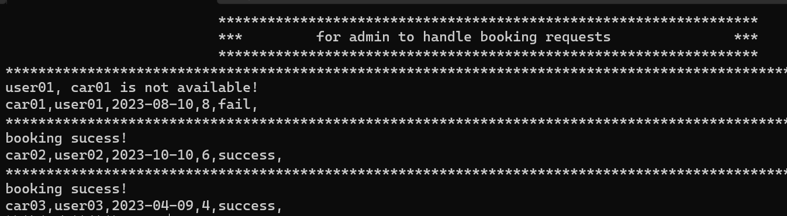

# Car Rental System User Manual

## Introduction

An overview: The intended audience of the User Manual for the Car Rental System is anyone who will be using the system, including customers and admins. The purpose of the system is to streamline the rental process, improve efficiency, and enhance customer satisfaction.

The key features of the Car Rental System include:

1. User Management: The system allows users to register and login to the system, with different privileges for customers and admins.

2. Car Management: The system maintains a database of available cars, including their details such as make, model, year, mileage, availability, minimum and maximum rent period. Admins can add, update, and delete car records.

3. Rental Booking: The system enables customers to view available cars and their details, and book a car by selecting a car, specifying rental dates, and providing necessary details.

4. Rental Management: The system allows admins to manage rental bookings, including approving or rejecting requests.

The scope of the User Manual is to cover all the features and functions of the Car Rental System, including user registration and login, car management, rental booking, and rental management. The manual should provide step-by-step instructions for each feature and function, along with any relevant screenshots or diagrams. 

If you have any questions or concerns about the Car Rental System or the User Manual, please feel free to contact Mr. Yang, at 123456789.

## Getting Started
Download and install visual studio 2022 at [visual studio microsoft](https://visualstudio.microsoft.com/)
Pull the project folder to local windows system.
Open carSystem.sln by vusial studio.

## User Management
The first page is the login and registration page: 

1. admin login: for the admin, default username/password are admin/123456.

2. user login: for other users, usernames and passwords are stored in users.csv.
before login:

after login:

3. user registration: new users are required to signup for using this system.
if the username does not conflict with existing users in "users.csv":

if conflict with existing usernames, shown as below: and otherwise successfully writen into users.csv.

## Car Management (Admin Only)
This part implements CRUD functions of car entries.

1. to add a car entry to "cars_fortest02.csv" (car entry database):

2. to remove a car entry by id, and suppose the car id do not exist in the "cars_fortest02.csv":

3. to update a car entry by id, and suppose the car id is correct:

and the cars_fortest02.csv (car entries database) has been updated.

4. to query all cars, and this option lists all car entries:

5. to query a car entry by id:

## Rental Booking (Customer Only)
users could query all the car entries and check if their favorite car is available:

then input enter to continue:

now the booking request has been uploaded to "booking.csv" and wait for admin to handle.

Columns in "booking.csv" are carid, username, start date, rental period, and request state; request state is set to be "wait" before handling the booking requests.

## Rental Management (Admin Only)
to handle car booking requests which had been writen in "booking.csv".
CarManage::handleBooking() is a one-time function carried out by admin. Users' booking requests are collected in "booking.csv", and admin could handle them automatically by running book-handling.

Columns in "booking.csv" are carid, username, start date, rental period, and request state; request state is set to be "wait" before handling the booking requests:

And for example, the availability (the sixth col in "cars_fortest02.csv") of car01, car02, car03 is 0 (Not available), 1 (Yes available), 1 (Y)

After carrying out handleBooking(), request state would be set to "fail" if the corresponding availability of the car entry is 0; request state would be set to "success" if the availability is 1. And simultaneously availability of the car entries would be set to 0 because they have been booken.

"booking.csv" after handleBooking():

"cars_fortest02.csv" after handleBooking():

